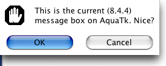
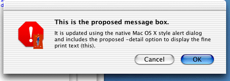

# TIP 152: New -detail Option for tk_messageBox
	Author:		Mats Bengtsson <matben@privat.utfors.se>
	State:		Final
	Type:		Project
	Tcl-Version:	8.5
	Vote:		Done
	Created: 	26-Aug-2003
	Obsoletes:	25
	Post-History:	
	Keywords:	Tk
-----

# Abstract

This TIP proposes a new option for the **tk\_messageBox** for text
that is less significant than the **-message** text.

# Rationale

Several platforms have a native feature of alert dialogs that includes
messages with both a bold or large font, and a text in fine print,
which gives more detail to the actual message.  Both Mac OS 8/9 and
Mac OS X include such a feature.  This TIP suggests that this should
be intruduced on all platforms, with the text to be displayed in that
format specified using a new option **-detail**.  In those cases where
it is not straightforward to distinguish between the **-message** and
**-detail** option contents, they should be combined into a single piece
of text in a way that makes sense on the platform.

# Reference Implementation

The proposed change is now implemented as a loadable extension \(in C\)
on Mac OS X
<http://hem.fyristorg.com/matben/download/MovableAlerts.dmg> .

The following images show the present \(8.4.4\) message box on AquaTk,
and the proposed one.

# Copyright

This document has been placed in the public domain

