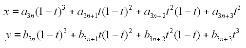

# TIP 168: Cubic Bezier Curves on the Canvas
	Author:		Lars Hellström <Lars.Hellstrom@math.umu.se>
	Type:		Project
	State:		Final
	Tcl-Version:	8.5
	Vote:		Done
	Created:	25-Jan-2004
	Post-History:	
	Tk-Ticket:	886240
-----

# Abstract

This document proposes a new **-smooth** method for **line** and
**polygon** canvas items that supports cubic Bezier curves and
clarifies some of the existing terminology in that area.

# Proposal

A new method for the **-smooth** canvas item option will be defined.
Under this method, the points defining the item will be interpreted as
a sequence _knot-point_ _control-point_ _control-point_
_knot-point_ _control-point_ _control-point_ ... of a curve
composed of cubic Bezier segments.  More precisely, if the list of
coordinates is

then the _N_th \(counting from zero\) segment of the curve consists of
points whose coordinates _\(x,y\)_ satisfies

for some value of _t_ between 0 and 1, inclusive.  If there are
_3N\+1_ points then the above defines an _N_ segment curve.  In the
case that the number of points is _3N_ or _3N-1_ then they shall
still define an _N_ segment curve, where in the first case the first
knot of the first segment is reused as the last knot in the last
segment, and in the second case the first knot and control point in
the first segment are reused as the last control point and knot in the
last segment respectively.

Straight line segments in the curve can be encoded as a segment where
the control points are equal to the neighbouring knot points.  While
this is not the only way to encode a straight line, it is a case that
is recognised and handled more efficiently by code that renders the
canvas item.

The name of this new method should be "**raw**".

The name of the existing **-smooth** method \(as returned by the
itemcget widget command\) should be changed from "**bezier**" to
"**true**", and the name "**bezier**", while at least in Tcl 8.5
still supported, should be deprecated.

# Rationale

Cubic Bezier curves, being for example the native curve format in
Postscript and its descendants, is probably the most common format for
smooth curves in computing today.  It is even used internally in Tk;
for each segment of a **-smooth 1** curve, rendering starts with the
calculation of a cubic Bezier representation of that curve and
continues to use only this representation when approximating the
smooth curve with straight line segments.  Hence it might be claimed
that the cubic Bezier curve is the "raw" format of a smooth curve in
Tk.  No new calculations need to be implemented in the core to
implement this TIP, it is merely a matter of combining existing
functions in a suitable way and move data around.  Therefore it seems
a waste to not provide cubic Bezier curves, when they are anyway
already half implemented.

The reason for the interpretation of a curve with _3N_ points given is
that this will cause the curve to be closed.  Conversely, omitting the
final knot point is sometimes used as a way of encoding the fact that
the curve should be closed.  This rule will therefore facilitate the
use of data where then omitted endpoint convention has been employed.
The only reason for the _3N-1_ point rule is that it fits a simple
scheme \(when at the end of the list of coordinates, continue from the
start\) that supports the _3N_ and _3N\+1_ cases.

The reason for deprecating the name "**bezier**" for the traditional
smoothing method is that it is at best confusing, and according to
many authorities simply wrong.  The term "Bezier curve" is very often
used as a synonym of "cubic Bezier curve", whence the majority of
programmers new to this feature of the canvas widget would probably
expect "**-smooth bezier**" to imply the effect of the smoothing option
proposed in this document rather than the smoothing via quadratic
splines that it currently is.  The amount of disappointment that could
result from the unpleasant discovery that what one thought was the
former is really the latter should not be underestimated.

The reason for changing the official name of the traditional smoothing
method to "**true**" are \(i\) that it is backwards compatible in the sense
that this name works for specifying that smoothing method in all Tk
versions and \(ii\) that it is somewhat mnemonic, because it happens to
coincide with the format used for curves in _True_Type fonts.

# Background

The question of what may rightfully be called "**bezier**" is somewhat
complicated and deserves expounding upon.  It really begins with
Bernstein; the _Bernstein degree n form_ of a polynomial f is

One advantage this form has over the standard form is that the
coefficients _a\_0, ..., a\_n_ are directly comparable to the function
values _f\(0\), f\(1/n\), f\(2/n\), ..., f\(1\)_; the two are generally not
equal \(with the exception for the endpoints of the _[0,1]_ interval\),
but the function values approximates the sequence of coefficients in
various useful ways.  \(Bernstein used it to give an elegant proof of
the Weierstrass Approximation Theorem.\)

A _Bezier curve_ \(or Bernstein-Bezier curve, as it is sometimes
called\) of degree _n_ is a parametric curve _P_ defined by a sequence of
_n\+1_ points _P\_0, ..., P\_n_ \(known as the _control points_ of the
curve\) where each coordinate function is the Bernstein polynomial one
gets by taking as _a\_k_ the corresponding coordinate of the point _P\_k_
and parametric time goes from _0_ to _1_; formally

for _t_ between _0_ and _1_ inclusive.  Higher degree Bezier
curves are not used much in computer graphics \(probably because the
effect on the curve of moving an single control point is often not
intuitively clear\) but they do exist and it is not illogical to expect
that a

	  $canvas create line $points -smooth bezier

should be the degree-[expr {[llength $points]/2 - 1\}] Bezier curve
defined by the given points.

Another term which often occurs when discussing computer graphic
curves is "spline".  A _spline_ is a curve that passes through a set
of given points \(the _knots_ of the curve\) in a given order,
satisfies some smoothness condition, and in some sense is best
possible under these conditions.  The most common optimality condition
is that the curve should be composed from segments that can be
parameterized by polynomials of given degree, but there are implicit
conditions \(minimizing some suitable measure of curve deformation\)
which leads to the same family of curves.

The **-smooth 1** curves of the Tk canvas are splines \(of degree _2_\) in
this sense, even though the points used for defining them are \(with
the exception for endpoints\) not the knots of the spline.  \(Rather,
the internal knots are the midpoints of the line segments joining two
adjacent control point.\)  The **raw** curves proposed here are in
general _not_ splines \(because they admit discontinuous changes in
tangent direction, thus violating the smoothness condition\), but they
often serve as an encoding for pre-computed degree 3 splines and this
use has lead to a confusion in terminology in this area.  It is not
uncommon that piecewise cubic Bezier curves in general are referred to
as "cubic splines", even though that is a more special concept.  It
may also be observed that the endpoints of the Bezier segments are
usually referred to as _knots_ of the curve, whereas the term
"control points" is often reserved for the non-knot control points.
This rather harmless convention is for example used above.  Incorrect
use of the word "spline" should however be avoided.

# Alternatives

It would be possible to provide the suggested functionality using a
compiled extension instead, but that seems a waste since almost all of
the functionality is present in the core anyway.

It would also be possible to use the semantics of the Tkspline package
<http://www.graphviz.org/cgi-bin/man?tkspline>  **-smooth** method
providing cubic Bezier curves, but that package reverts to using the
**-smooth true** method of smoothing if the number of points is not _3N\+1_,
which doesn't seem useful and may cause bugs to be less visible.
Using the Tkspline syntax \(calling the **-smooth** method "spline"\) should
probably be avoided even if the two methods were compatible, since the
curves produced in general aren't splines.

# Implementation

A sample implementation of this proposal \(minus the part about
changing the name of the existing **-smooth** method\) exists
<http://sf.net/tracker/?func=detail&aid=886240&group_id=12997&atid=312997> .

# Copyright

This document has been placed in the public domain.

