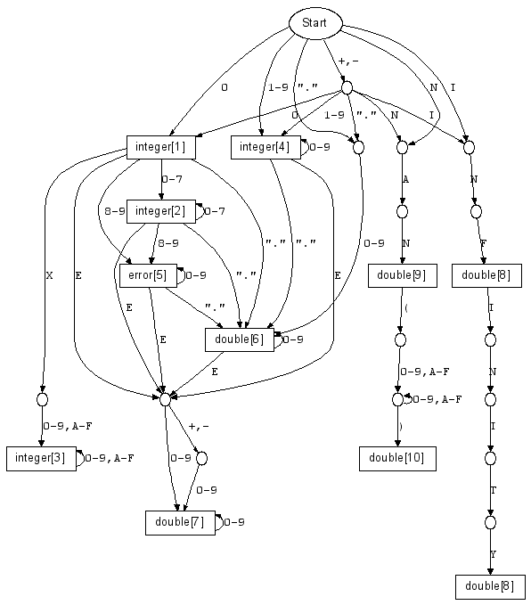

# TIP 249: Unification of Tcl's Parsing of Numbers
	Author:         Kevin B. Kenny <kennykb@acm.org>
	Author:         David S. Cargo <escargo@skypoint.com>
	Author:         Don Porter <dgp@users.sf.net>
	State:          Draft
	Type:           Informative
	Vote:           No voting
	Created:        13-Jun-2005
	Post-History:   
-----

# Abstract

This TIP proposes to unify the recognition of all of Tcl's "numeric"
objects into a single parser.  The intended effect is to improve
performance by eliminating a number of cases where a cached numeric
representation may be discarded, and to restore \(more accurately,
to establish\) the "everything is a string" principle in dealing with
numbers.

# Rationale

Tcl's handling of numbers has always been problematic and ambiguous.
Even in the earliest releases of the **expr** command, there were
issues with the unexpected demotion of floating point numbers to
integers, causing subsequent divisions to be interpreted as integer
division with incorrect results.

Another trouble spot has been the interpretation of constants with
leading zeroes.  When these are interpreted as integers, they are
octal numbers.  They can also be interpreted as floating point
constants \(at least with _Tcl\_GetDoubleFromObj_\), in which case they
are decimal.  Because of this ambiguity, the **expr** system cannot
make effective use of the internal representation of a floating point
number; it needs to refer back to the string to make sure that the
number is not an octal integer to which _Tcl\_GetDoubleFromObj_ has
been applied.

Even more confusing is the treatment of numbers that have leading
zeroes but contain the digits 8 or 9.  These are rejected by the
**expr** parser as invalid octal but are accepted by
_Tcl\_GetDoubleFromObj_.

# Proposal

This TIP proposes a strict "everything is a string" interpretation
for strings as numeric values.  The set of strings that can be
interpreted as numbers shall be partitioned into disjoint subsets,
with a single "canonical" representation for each.

This change will imply that a few C calls will break compatibility.
In particular, _Tcl\_GetDoubleFromObj_ may leave an integer internal
representation in the object, despite the documentation's assertion
that the object will shimmer.  Similarly, _Tcl\_GetDoubleFromObj_
will no longer interpret octal integers as decimal; this feature
causes only surprise and consternation.

The _Tcl\_ConvertToType_ call will also no longer force conversion
to a specific numeric type.  Since it does not do so, it is not
reasonable for extensions to use it on the numeric types.  For this
reason, the numeric types _shall not be registered;_
_Tcl\_GetObjType_ will fail when presented with one of their names.

When one of the conversion procedures _Tcl\_GetIntFromObj_,
_Tcl\_GetWideIntFromObj_,  _Tcl\_GetBignumFromObj_ \(assuming the
eventual approval of [[237]](237.md)\), or _Tcl\_GetDoubleFromObj_ is called,
it will cast any pre-existing numeric internal representation that
it finds to the appropriate return type \(throwing an error if the
number is too large to represent, or a double is used in an integer
context\).  If the procedure finds no pre-existing numeric internal
representation, it will extract the string representation, determine
its canonical representation as a number, and store that.

The easiest way to visualize the specific sets of strings that are
recognized as numbers is with a diagram of the state machine that
implements them.

In the diagram, "Start" represents the start state of the machine.
The leading and trailing whitespace that is allowed for all numbers
is not diagrammed, for clarity.

Intermediate states of the machine are represented by small ovals.
Large rectangles represent final states, and are labeled with
the type of number that will result.  Note that any number can
optionally begin with a '\+' or '-' character, which will not
be mentioned further.  Each of the accepting states, however,
merits further discussion.

 1. The string "0" shall always represent an integer of the smallest
    type available \(**tclIntType**\). It shall never represent a
    floating point value.

 2. A leading zero followed by a string of octal digits shall be
    interpreted as an octal integer.  The integer shall be stored in
    the smallest of **tclIntType**, **tclWideIntType** and
    **tclBignumType** that will hold it.  \(Note that storing
    **tclBignumType** is possible without accepting [[237]](237.md), provided
    that the _Tcl\_Get\*FromObj_ routines recognize it and convert its
    value as needed.\)  The interpretation as an octal integer shall
    hold even if the string is presented to _Tcl\_GetDoubleFromObj_,
    which today interprets it as decimal.

 3. A leading zero, followed by the letter 'X' \(case insensitive\) and a
    string of hexadecimal digits shall be interpreted as a hexadecimal
    integer.  Again, the smallest representation needed is chosen.

 4. A string of decimal digits beginning with a nonzero digit is
    interpreted as a decimal integer and stored in the smallest
    suitable internal representation.

 5. A string of digits beginning with a zero but containing the digits
    **8** or **9** is an error; it appears to be bad octal.  It
    would be possible to allow this case in _Tcl\_GetDoubleFromObj_,
    but it seems unwise, since the consequence would be that **string
    is double** would accept "double" strings that will fail in
    **expr**.

 6. A string consisting of a nonempty sequence of decimal digits and
    a single period \(which may appear anywhere within the string\) is a
    valid floating point constant in 'F' format, even if it begins
    with '0'.  It is interpreted in decimal and stored in a
    **tclDoubleType**.  If the input number is too small to
    represent, an appropriately signed zero is stored.  If the input
    number is too large to represent, an appropriately signed infinity
    is stored.

 7. Floating point numbers in the usual 'E' format are accepted and
    interpreted in decimal. Once again, they are stored in
    **tclDoubleType** and are replaced with zero or infinity if they
    are too small or large.

 8. The constants, "Inf", and "Infinity" \(perhaps with a leading
    signum\) are interpreted as infinities.  Infinity is represented as
    **tclDoubleType.**

 9. The constant "NaN" is the IEEE "Not a Number" value.  It is
    specifically permitted in the parser so that **binary format q
    NaN** and similar calls can produce NaN on an external medium.
    The presence of NaN in expressions, or in
    _Tcl\_GetDoubleFromObj_, signals an error.  NaN is represented as
    **tclDoubleType**.

 10. IEEE floating point does not have a single unique NaN value, so a
     NaN may be augmented by a parenthesized string of hexadecimal
     digits, which will be stored in its least significant bits.  It
     shall not be possible to construct signalling NaN by this route;
     only quiet NaN will be supported.  NaN is represented as
     **tclDoubleType.**

# Additions

In addition to the base state machine detailed above,
the state machine of the reference implementation
contains additional states to parse integer values
beginning with the **0b** or **0o** prefixes as
originally proposed in [[114]](114.md).  Getting these prefixes
recognized in Tcl 8.5 is an important migration step
to support migration to whatever version of Tcl drops
the "leading **0** implies octal format" rule.

Also in addition, the parsing routine will accept a
_flags_ value containing the flag bits below that
exert finer control on the parsing.  These extra
controls were found to be required to permit the
[scan] command to use the same parser.

   * **TCL\_PARSE\_INTEGER\_ONLY** -- accept only integer values;
     reject strings that denote floating point values \(or
     accept only the leading portion of them that are integer
     values\).

   * **TCL\_PARSE\_SCAN\_PREFIXES** -- ignore the prefixes **0b**
     and **0o** that are not part of the [scan] command's
     vocabulary.  Use only in combination with
     **TCL\_PARSE\_INTEGER\_ONLY**.

   * **TCL\_PARSE\_OCTAL\_ONLY** - parse only in the octal format,
     whether or not a prefix is present that would lead to octal
     parsing.  Use only in combination with
     **TCL\_PARSE\_INTEGER\_ONLY**.

   * **TCL\_PARSE\_HEXADECIMAL\_ONLY** - parse only in the
     hexadecimal format,
     whether or not a prefix is present that would lead to hexadecimal
     parsing.  Use only in combination with
     **TCL\_PARSE\_INTEGER\_ONLY**.

   * **TCL\_PARSE\_DECIMAL\_ONLY** - parse only in the decimal format,
     no
     matter whether a **0** prefix would normally force a different
     base.

# Incompatibilities

The change described is sufficient to run the Tcl and Tk test suites with
unwanted test results only in the detailed format of error messages
for integer overflow and in the types returned by using the
**testobj** command \(not part of the usual distribution\) to
introspect them.  Despite this reassurance, several potential
incompatibilities are identified.

First, as mentioned above, C extensions will no longer have fine
control over Tcl's built-in numeric types, because the types
will not be registered and hence will be unavailable for use
with _Tcl\_ConvertToType._ This is actually a
good thing, since it means that the rest of Tcl can assume that
they are well-behaved, resulting in a considerable simplification.
Most of the Tcl Core Team believes that _Tcl\_ConvertToType_
has no legitimate use in any case.

Second, it will no longer be correct to assume that
_Tcl\_Get\*FromObj_ will leave an internal representation of
precisely the requested type.  It is, in any case, a highly
questionable practice for callers to assume a specific internal
representation \(with the possible exception of Tcl\_Set\*Obj and
Tcl\_New\*Obj\).  There will no doubt be a few extensions that run
afoul of this change, but they can be fixed easily in such a way
that they will continue to compile and run on earlier versions
of Tcl.

Third, _Tcl\_GetDoubleFromObj_ will be both more and less permissive
than before.  It will no longer accept constants with a leading zero
and no decimal point or 'E' that are invalid octal numbers.
On the other hand, it will accept
constants that are too large to fit in a **Tcl\_WideInt**; somewhat
surprisingly, **string repeat 9 50** cannot today be interpreted as
a double.  **string is double** will follow _Tcl\_GetDoubleFromObj_
in what it considers acceptable.  Any string that is accepted as
either an integer or a double by **expr** will be accepted in
_Tcl\_GetDoubleFromObj_, and only those strings will be accepted.

Fourth, the recognition of **0b** and **0o** as valid
prefixes for integer values is a type of incompatibility.

# Reference Implementation

See [[237]](237.md) for more implementation details.

# Copyright

Copyright \(c\) 2005 by Kevin B. Kenny.  All rights reserved.  

This document may be distributed subject to the terms and conditions
set forth in the Open Publication License, version 1.0
<http://www.opencontent.org/openpub/> .

