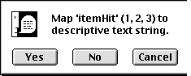
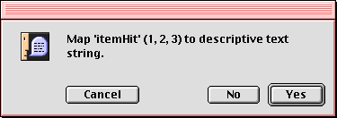

# TIP 25: Native tk_messageBox  on Macintosh
	Author:		Mats Bengtsson <matben@privat.utfors.se>
	State:		Withdrawn
	Type:		Project
	Tcl-Version:	8.5
	Vote:		Pending
	Created: 	07-Feb-2001
	Obsoleted-By:	152
	Post-History:
-----

# Abstract

This is a replacement for the _tk\_messageBox_ on the Macintosh with
a native implementation which is compliant with the Appearance Manager
in Mac OS 8 and later.

# Rationale

The present \(in 8.3.2p1 and earlier\) _tk\_messageBox_ on the Macintosh 
is non-movable, and lacks many features that are required to be compliant 
with Mac OS 8 and later. Non-movable dialogs should be abandoned in a 
multitasking environment. This TIP presents a step to extend the native
appearance on the Macintosh.

 

# Reference Implementation

The proposed change is now implemented as a loadable extension \(in C\)
on Macintosh, and can be downloaded at
<http://hem.fyristorg.com/matben/download/MovableAlerts.sit> .
This extension requires Tk 8.3.2p1 or later due to the changed stub
loading mechanism.  The core of the code should go in the
_tkMacDialog.c_ file. Some additional changes are necessary in order
to load the new _tk\_messageBox_ and not the old, script based
_tk\_messageBox_. Also, need to check for the presence of the
Appearance manager:

	if (Appearance Manager)
	    use native (new) messageBox
	else
	    use present script based messageBox

All functionality from the documentation that are applicable are
implemented, with some exceptions:

    *   There is a _-finemessage_ option to support the native
        text message set in a smaller font below the main message.
        
    *   Both _-message_ and _-finemessage_ option are truncated at
        255 characters.
        
    *   Buttons appear from right to left instead of vice versa.
    
    *   There is always a default button.        

All these deviations are consistent with the look-and-feel of
Mac OS 8.0 and on. Existing scripts using _tk\_messageBox_ are
compatible with the new _tk\_messageBox_.

Open questions: 

    * 	Name of extra option _-finemessage_

    *	Name of the two C functions in the implementation

    *	How to make the core code call the new code instead of
	the original, script implemented

# Copyright

This document has been placed in the public domain

