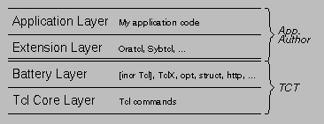
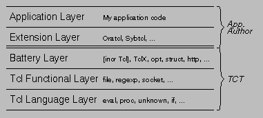

# TIP 4: Tcl Release and Distribution Philosophy
	Author:         Brent Welch <welch@acm.org>
	Author:         Donal K. Fellows <fellowsd@cs.man.ac.uk>
	Author:         Larry W. Virden <lvirden@cas.org>
	Author:         Larry W. Virden <lvirden@yahoo.com>
	State:          Draft
	Type:           Informative
	Vote:           Pending
	Created:        26-Oct-2000
	Post-History:   
	Discussions-To: news:comp.lang.tcl
-----

# Abstract

This document outlines how Tcl should be distributed, with
particular reference to issues related to building a
distribution with the _batteries included_ so that most people
can have access to the useful extensions without having to
chasing halfway across the 'net for them.

# Overview

Tcl has traditionally been a "core" that is extensible with binary
extensions and Tcl scripts.  There have been two styles of Tcl
distributions: source and binary.  The Tcl source distribution
contains the Tcl "core" and a small number of support scripts.  The
binary distributions have included Tk, and in some cases \(e.g.,
TclPro\) other extensions like [incr Tcl], TclX, and Expect.  Users
with access to a compiler can get source distributions of the various
extensions and compile them for their own installation.  _\(Thanks to
Bob Technetin <techentin.robert@mayo.edu> for the inspiration for
these pictures - DKF.\)_

This proposal formalizes the notion of a small Tcl source core
and larger distribution bundle that includes one or many
extensions.  The distribution can be in source or binary form.
The goal is to keep a small core that is suitable for embedding
with the smallest footprint, while acknowleding that desktop
users and application developers want a larger _standard
distribution_ that has a set of well known and widely used
extensions.

The goal of this proposal is to establish a standard
for future Tcl distributions.  There will be two kinds
of Tcl distributions:  a small core suitable for
specialized embedded applications, and a larger bundled
distribution suitable for more general application
development.

# The Tcl Core Distribution

The Tcl "core" should remain as small as possible, and could
become smaller in the future as certain features are moved into
extensions.  The "core" distribution must include:

 1. The C sources required to create the Tcl binary library.

 1. The C sources required to create a "Tcl Shell" application.
    This is commonly known as "tclsh".

 1. The Tcl script libraries that implement the code library and
    packaging systems.  This includes the "unknown" command and
    various commands related to auto loading of packages.

 1. The Tcl test framework used for testing the Tcl binary
    library and the support scripts.

Additional items may appear in the "core" distribution,
especially for historical reasons.  But, some Tcl scripts and
binary extensions that currently exist \(as of Tcl 8.3\) in the
Tcl source distributions may migrate into the larger
distribution described below.

# The Bundled Distribution

The _bundled_ Tcl distribution will contain Tcl, various
binary extensions, and various Tcl script packages.  This
proposal establishes an initial set of binary extensions, but
following the model and using the distribution infrastructure we
create, various bundles should be easily created.

Each package included in the bundled distribution must
have a test suite and documentation.  At this stage
the documentation will probably be in a variety of
formats, but ultimately we should standardize on an
XML-based representation and supply tools that generate
other formats from that representation.

# Mandatory Packages

The bundled distribution must include \(but is not limited to\):

 1. The "core" distribution described above.

 1. The Tk toolkit for GUI applications.  This includes the well
    known "wish" shell application.

 1. The registry and dde extensions for the Windows platform.

 1. The [incr Tcl] extension.  

 1. The TclX extension.  There are some historical features of
    TclX that should not necessarily be included, including the
    tclx shell and its alternate library format.  However, the
    TclX help system should not only be included, but updated to
    include info on all commands included in the distribution.

 1. The Expect extension for UNIX platforms.

 1. The TkCon enhanced console application.

# Optional Packages

In addition, it is likely that several of the following packages
will be included in the bundled distribution, as well as
others not listed.

 1. The Standard Tcl Library of Tcl scripts.  Currently this
    includes packages for:

	 > 1. base64 encoding/decoding

	 > 1. file utilities

	 > 1. command line processing

	 > 1. FTP client library

	 > 1. FTP server

	 > 1. HTML and JavaScript generation

	 > 1. Math and statistics utilities

	 > 1. MIME encoder and parser

	 > 1. CGI processing \(ncgi\)

	 > 1. NNTP client

	 > 1. POP3 client

	 > 1. Profiler for Tcl scripts

	 > 1. Event counters and interval timers

	 > 1. Structures, including tree, stack, graph, queue

	 > 1. URI parsing

	 > 1. Text string manipulation utilities \(trim, tab, etc.\)

 1. BLT.

 1. [incr Tk] and [incr Widgets].

 1. TkTable.

 1. The Standard Tk Library of Tcl/Tk scripts.  Currently
    this includes packages for:

	 > 1. BWidgets

	 > 1. mclistbox

 1. Img

# Rationale

The small "core" distribution must retain its identity for those
applications that embed the Tcl interpreter into constrained
environments and require a small footprint. The footprint must
remain small, and in fact it should grow smaller, if possible.
For example, in the early days of Tcl it was possible at compile
time to remove all the file system and exec commands to create a
very small Tcl core.  There are wide variety of vendors that
embed Tcl into, e.g., CAD applications, router firmware, and
other limited environments.  They only need the basic commands
for procedural programming and basic data types.

The larger, bundled distribution must become the standard for
desktop distributions \(e.g., Linux\) so that application writers
have a richer set of Tcl commands that they can assume are
available.  This includes the [incr Tcl] class system and the
OS-specific commands provided the TclX and the registry and dde
extensions.

The set of packages in the bundled distribution are divided into
_mandatory_ and _optional_ packages.  The intent of this
distinction is to set a goal for the initial _bundled_
distribution, but not close the door to inclusion of other
packages.  Over time the set of packages in the bundled
distribution will surely grow, and some packages may become
superceeded by other better packages.  The _mandatory set_ of
packages, however, should be common among all bundles to
application writers know what to expect.

In particular, the mandatory set includes [incr Tcl] to
promote object oriented programming, Tk to promote easy GUI
development, TclX, Dde and Registry to provide access to
OS-dependent functionality, and Expect to support automated test
environments.

At this time there are a variety of Tk widgets that are optional
because there is some overlap and we anticipate continuted
evolution of the Tk widget set.  I expect that the first bundle
will include all the major widget sets, including BLT, [incr
Tk] and [incr Widgets], TkTable, the "vu" collection, and
possibly Tix.

# The Role of the TCT

The larger bundled distribution will contain packages that are
"owned" by the TCT and some that are not.  The whole process
will be more scalable if responsibility for packages can be
split out to other individuals and groups.  The role of the TCT
should be to set up the infrastructure for the bundled
distribution and to make _official_ bundled distributions.

# Issues

The main purpose of this proposal is to establish three things:

 1. The continued existence of a small Tcl "core" that is
    identifiable unto its own and useful to various specialized
    embedded applications.

 1. The creation of infrastructure to create bundled
    distributions.  The exact nature of this bundling is not
    specified.  The first bundles may well be created by hand
    crafted Makefiles and distribution-creation scripts.

 1. The set of _mandatory_ extensions that should be included
    in any Tcl bundle.  The list in the first draft of this TIP
    is likely to be wrong, and will surely be amended in the
    future.

 1. Whether further distinctions should be introduced to better
    support people who wish to target Tcl towards small devices or
    embedded environments better.

There are a number of related topics that are deliberately
outside the scope of this TIP:

 1. Documentation format. 

 1. Network aware downloading of packages and more sophisticated
    package management.

 1. Details of the compile and build environment.  Currently
    there is the TEA standard, and the packages listed in the
    Mandatory set have all been set up for TEA as part of
    TclPro.

# Copyright

This document has been placed in the public domain.

