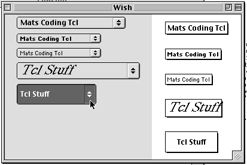

# TIP 51: Native Menubutton on Macintosh
	Author:         Mats Bengtsson <matben@privat.utfors.se>
	State:          Withdrawn
	Type:           Project
	Tcl-Version:    8.5
	Vote:           Pending
	Created:        04-Aug-2001
	Post-History:
-----

# Abstract

This is a replacement for the menubutton on the Macintosh with a
native implementation which is compliant with the Appearance Manager
in Mac OS 8 and later.

# Rationale

The present \(in 8.3.3 and earlier\) menubutton on the Macintosh is
implemented using Tk drawing to draw something similar to the native
menubutton on Mac how it looks on Pre Mac OS 8.0 systems, and
therefore fails to give the correct appearance on Mac OS 8.0 systems
and later. This TIP presents a step to increase the native appearance
on the Macintosh \(similar to [[25]](25.md).\)

# Reference Implementation

The proposed change is now implemented as a loadable extension \(in C\)
on Macintosh, and can be downloaded
<http://hem.fyristorg.com/matben/download/MacMenuButton.sit> . This
implementation differs from the other buttons in Mac Tk \(button,
radiobutton, checkbutton\), which use a mixture of native Apple drawing
code and Tk drawing code, since it uses only native Apple code for
drawing.  This extension requires Tcl/Tk 8.3.2p1 or later due to the
changed stub loading mechanism. The new implementation is not a
complete replacement since it lacks the _-bitmap_ and _-image_
options, and a few other things, see below.

The changes necessary are:

    * Replace the _tkMacMenubutton.c_ file with the new one.

    * Add a MENU resource item, which is included in the shared library,
      but needs to be added to the core.

    * Modifications to _tkMacFont.c_ \(see appendix\). Put declaration
      so it can be used from any file. Possibly also add the new
      function to the stub table since it can be practical for other
      extension writers.

    * Need to check for the presence of the Appearance manager:

		if (TkMacHaveAppearance()) 
		   use native (new) menubutton 
		else 
		   use present menubutton

All functionality from the documentation that is applicable is
implemented in the extension, with some exceptions:

    * The _-image_ and _-bitmap_ options are not supported, yet.
    
    * There is no button pressed \(SELECTED\) flag so it highlights when
      the mouse enters, just as a reminder that it must be fixed.
      \(see appendix\)
        
    * Don't know which color to pick for the three pixels in each
      corner.  It is now the _-background_ color, but the ordinary
      button uses _-highlightbackground_?
    
    * The position of the popup menu should be changed in order to
      conform better with standard Mac appearance..
    
    * Something needs to be done so that we can get Mac native font
      stuffs from a _Tk\_Font_ object; I've included a crude hack in
      the appendix.
        
    * It is compliant to the Appearance Manager which means that
      foreground and background colors are set via themes and not from
      command switches.

    * Minor differences to comply with the Appearance Manager.

All these deviations are consistent with the look-and-feel of Mac OS
8.0 and on. Existing scripts using menubutton are compatible with the
new menubutton.

Open questions: 

    * Option to use for the color of the corner pixels.

    * If \(and how\) a SELECTED flag should be added to
      _tkMenuButton.h_, and code to support it in
      _tkMenuButton.c_.

    * Implementation of the _-bitmap_ and _-image_ options.

    * A _-compound_ option as described in TIP \#11.

# Copyright

This document has been placed in the public domain.

# Appendix

    * Addition to _tkMenuButton.h_:

		#define SELECTED		8

	    > Other modifications to tkMenuButton.c must be made to support
      this flag.

    * Addition to _tkMacFont.c_ \(possibly add to exported
      functions\):

		/*
		 *---------------------------------------------------------------------------
		 *
		 * GetMacFontAttributes -- 
		 *
		 *      Takes a Tk_Font and gets the Mac font attributes faceNum, size, and style.
		 *      Note that the Mac font size is in pixels while the Tk_Font size is
		 *      in points. No need to do any UTF-8 translations since this is
		 *      implicit in GetFamilyOrAliasNum().
		 *      The code here is essentially a modified TkpGetFontFromAttributes() and
		 *      InitFont(), both from tkMacFont.c.
		 *
		 * Results:
		 *      Sets the Mac font attributes.
		 *
		 * Side effects:
		 *      None.
		 *
		 *---------------------------------------------------------------------------
		 */
		void
		GetMacFontAttributes(
		        Tk_Window tkwin,        /* Tk window. (in) */
		        Tk_Font tkFont,         /* Tk font. (in) */
		        short *faceNumPtr,      /* Mac font face id. (out) */
		        short *macSizePtr,      /* Mac font size in pixels. (out) */
		        Style *stylePtr)        /* Mac font style specifier. (out) */
		{
		    int i, j;
		    char *faceName, *fallback;
		    char ***fallbacks;
		    MacFont *fontPtr;
		    const TkFontAttributes *faPtr;
		    int size;           /* Size in points. */
		        
		    /*
		     * This is just a macro to access the attribute struct member.
		     */
		     
		    faPtr = GetFontAttributes(tkFont);
		
		    /*
		     * Algorithm to get the closest font to the one requested.
		     *
		     * try fontname
		     * try all aliases for fontname
		     * foreach fallback for fontname
		     *      try the fallback
		     *      try all aliases for the fallback
		     */
		     
		    *faceNumPtr = 0;
		    faceName = faPtr->family;
		    if (faceName != NULL) {
		        if (GetFamilyOrAliasNum(faceName, faceNumPtr) != 0) {
		            goto found;
		        }
		        fallbacks = TkFontGetFallbacks();
		        for (i = 0; fallbacks[i] != NULL; i++) {
		            for (j = 0; (fallback = fallbacks[i][j]) != NULL; j++) {
		                if (strcasecmp(faceName, fallback) == 0) {
		                    for (j = 0; (fallback = fallbacks[i][j]) != NULL; j++) {
		                        if (GetFamilyOrAliasNum(fallback, faceNumPtr)) {
		                            goto found;
		                        }
		                    }
		                }
		                break;
		            }
		        }
		    }
		    
		    found:    
		    *stylePtr = 0;
		    if (faPtr->weight != TK_FW_NORMAL) {
		        *stylePtr |= bold;
		    }
		    if (faPtr->slant != TK_FS_ROMAN) {
		        *stylePtr |= italic;
		    }
		    if (faPtr->underline) {
		        *stylePtr |= underline;
		    }
		    if (faPtr->size == 0) {
		        size = -GetDefFontSize();
		    } else {
		        size = faPtr->size;
		    }
		    *macSizePtr = (short) TkFontGetPixels(tkwin, size);
		}

