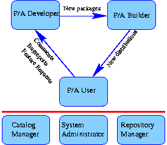
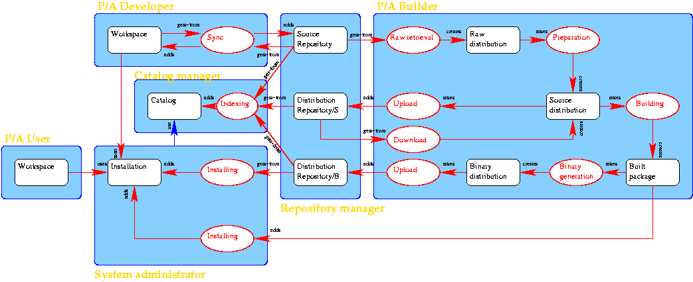
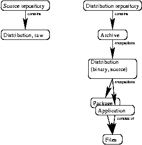

# TIP 78: TEA 2.0 Definitions
	Author:         Andreas Kupries <andreas_kupries@users.sourceforge.net>
	Author:         Larry W. Virden <lvirden@yahoo.com>
	State:          Draft
	Type:           Informative
	Vote:           Pending
	Created:        15-Dec-2001
	Post-History:   
-----

# Abstract

This document is an informational TIP providing definitions for
commonly used terms \(like package, extension, core, distribution,
etc.\) to make future communication among people in the community
easier.  It is recommended that future and past documents specifying
details inside of the greater context of TEA refer to this document to
ensure a consistent usage of terms.

# Background

This document is an adjunct to the [TIP <<vision>>].  _\(DKF - Is
this meant to be a reference to [[34]](34.md)?  Edit to such if so...\)_

To facilitate the specification and adoption of clearly defined
interfaces to various activities and technologies it specifies a
number of terms used by the community at large to create a greater
unity and coherence in the usage of these terms.  In other words, by
creating generally accepted definitions for important terms the risk
of misunderstanding each other is reduced.

# Specification of Technical Terms

This section specifies a number of important technical terms in
alphabetical order.  Terms used inside of a specification are
highlighted.

 * Application

	 > An entity implementing some functionality required by a _P/A
   User_ \(see section _Roles_\) to perform his work.  Consists of
   one more files.  May make use of _packages_ to implement its
   functionality.

 * Archive

	 > Encapsulation of a _distribution_ in a single file.  Well-known
   formats for archives are tar, gzipped tar, bzipped tar, and zip.

 * Binary generation

	 > The process of wrapping up a built package into a binary
   _distribution_.  See _building_ too.

 * Building

	 > The process of _configuring_ and _transforming_ a source
   _distribution_ into a set of files which can be either
   immediately installed on the site which built them or wrapped into
   a binary _distribution_ for shipment to other sites.  This also
   includes the execution of a test-suite coming with the package.

 * Bundle

	 > A _distribution_ encapsulating more than one _package_.

 * Catalog

	 > A catalog is a site providing an index of the packages.

 * Configuration

	 > The process of customizing a source distribution for a particular
   architecture and/or site.  A part of _Building_.

 * Conflict

	 > Two or more packages are said to be in conflict if the usage of one of them
   excludes the usage of the others.

	 > In a _strong conflict_ installing one of the packages disallows
   even the installation of the others.

 * Core

	 > A shorthand for _Tcl core_.

 * Core distribution.

	 > See _Tcl core distribution_.

 * Dependency

	 > A relationship between packages.  A package X is said dependent on
   another package Y if said package Y is required to allow X to work.

	 > There are several types of dependencies:

	 > \* Build-time dependency

	 > > Y is required to allow X to be build.

	 > \* Run-time dependency

	 > > Y is required to allow the usage of an installed X.

	 > \* Optional dependency

	 > > Y can be used by X \(usually for improved performance\) but is not
     required for building or use.

 * Distribution

	 > An encapsulation of one or more _packages_ for transport between
   places, machines, organizations, and people.  Several types of
   distributions are possible, explained below.

	 > 1. binary

	 > > A binary distribution is in a state and format allowing the
     installation of the contained packages on a particular platform.

	 > > It contains at least all the files

	 > > \* implementing the functionality of the distributed packages and

	 > > \* required to allow the package management of the Tcl core to
       handle the packages.

	 > > A binary distribution usually contains just the files for a
     single architecture.  This is not a explicit requirement however.
     In other words, a binary distribution is allowed to contain the
     files for several architectures.  Such a binary distribution will
     be called a _fat binary distribution_.

	 > > We distinguish between three sub-types:

	 > > \* installable

	 > > > This is the minimal binary distribution we spoke of before.

	 > > \* auto-installable

	 > > > Like _installable**, but additionally contains an application
       whose execution will perform all the steps which are necessary
       to install the contained packages at a site.  The installation
       to add the packages to \(and thus the location of the installed
       packages\) can be freely chosen by the caller of the executable.

	 > > \* auto-image

	 > > > Like _auto-installable_, but the final location of the
       packages is hard-wired into the distribution.  This means that
       a site using auto-images is restricted to one installation per
       architecture for which files are contained in the binary
       distribution.

	 > > > Some of the existing archive formats restrict their contained
       distributions to this type.  Examples of such archive formats
       are

	 > > > \* RPM \(RedHat Package Manager\)

	 > > > \* DEB \(DEBian Linux package format\)

	 > > See [TIP 55] for the specification of a proposed layout for
     binary distributions.

	 > 1. bundle

	 > > A distribution which either contains the distributions of more
     than one package or a list of references to packages.  The
     references are done by specifying the name and version of the
     packages contained in the bundle.

	 > 1. buildable

	 > > See _source_.

	 > 1. compileable

	 > > See _source_.

	 > 1. raw

	 > > A raw distribution is the most fundamental distribution.  Its
     format is nearly completely unspecified.  Its contents are
     straight from a source repository.  The process of converting a
     raw distribution into a source distribution is called
     _Preparation_.

	 > > Because of the unformatted nature of a raw distribution the
     commands for its conversion into a source distribution have to be
     part of it.  This is the only part of a raw distribution which
     can and has to be specified.

	 > > Example: The execution of _autoconf_ to generate a
     _configure_ script from its _configure.in_ file can be a
     single step in a complex preparation.

	 > 1. source

	 > > A source distribution is in a format and state where tools can be
     used to build its contents.

	 > > The format needs further specification but for now we can assume
     that it is governed by the current TEA specification.

	 > > Alternate name for this type of distribution are _compileable_
     and _buildable_.

 * Distribution repository

	 > See _repository_

 * Extension

	 > Alternate name for a _package_, generally used for packages
   requiring compilation to become functional.

	 > This term is _deprecated_.

 * Installation

	 > A special type of _distribution repository, binary_ \(see
   _repository_\) containing all _packages_ which were installed on
   a site.  A site may host several installations differing in version
   and/or configuration of Tcl, and/or the platform Tcl was built for,
   etc.

	 > Currently difficult to do but in the future it should made be
   possible for an installation to refer and use another installation,
   provided both are configured identically.  This allows a site to
   build a hierarchy of installations from the most general containing
   the common packages down to installations associated with one or
   more _P/A Developers_.

 * Installing

	 > The process of unpacking a binary distribution and adding the
   contained packages to an _installation_.  The latter may include
   moving files to their proper places.

	 > Also the process of adding a built package to an _installation_.

 * Manifest

	 > A file detailing the files making up a particular package.

 * Package

	 > A collection of files providing additional functionality to a user
   of a Tcl interpreter when loaded into said interpreter.

	 > Some files in a package implement the provided functionality
   whereas other files contain meta-information required by the
   package management of Tcl to be able to use the package.

 * Preparation

	 > The process of converting a raw _distribution_ into a source
   _distribution_ suitable as input to _building_.  This includes
   actions like:

	 > \* Retrieval of sources from a source repository

	 > \* Creating a _configure_ file from its _configure.in_.

	 > \* Creating the distributed documentation from internal sources.

	 > \* Removal of internal files containing notes, scratch info and the like.

	 > \* Inserting version information into files.

	 > \* ...

	 > The tool _makedist_ \(which I wrote\) is in my mind when thinking
   about this step.

 * Raw retrieval

	 > The process of retrieving a raw _distribution_ from a _source
   repository_.

 * Repository

	 > General term with two possible meanings.

	 > 1. A collection of _archives_.  The exact term for this type of
     repository is "distribution repository".

	 > > If a distribution repository is restricted to one type of
     distributions this type can be added to the term as further
     specification of the type of repository.  Thus

	 > > \* _distribution repository, binary_, or

	 > > \* _distribution repository, source_.

	 > 2. A collection of directories, developer files and control files
      containing version control information.  The exact term for this
      type of repository is _source repository_.

	 > > A repository can either be internal to an organization or public.

 * Source repository

	 > See _repository_

 * Tcl core

	 > The most fundamental part in the Tcl world; the interpreter engine
   and the builtin commands coming with it.  These are all commands
   and procedures reported by _info commands_ for a _tclsh_ which
   was started with an empty _.tclshrc_ file and after sourcing all
   _.tcl_ files in the directory returned by _info library_.

 * Tcl core distribution

	 > The most fundamental distribution there is.  Contains the _Tcl
   core_ and a number of packages.

# Roles

The terms in the preceding section specified both passive data
structures and actions upon them.  This section specifies the possible
actors, i.e. entities which perform one or more of these actions.

To make the specification easier, related actions are grouped into
roles of behavior.  The mapping from roles to actual actors,
i.e. people and organizations is n:m.  On other words, one actor may
have several roles, either at once or changing over time and one role
can be held by several distinct actors.

Examples are given at the end of this section.

 1. Catalog manager

	 > A catalog manager handles one or more catalogs.  He is responsible
   for

	 > \* the final name arbitration for packages with conflicting names

	 > \* and the categorization of the packages indexed by the catalog.

 1. P/A Builder

	 > A package and/or application builder is a person and/or organization

	 > \* who retrieves raw distributions from source repositories and \(in
     a sequence of several steps\) generates binary distributions from
     them.

	 > \* or who retrieves source distributions from distribution
     repositories and \(in a sequence of several steps\) generates
     binary distributions from them.

	 > \* uploads the generated binary distributions into one or more
     distribution repositories.

	 > \* uploads the generated source distributions into one or more
     distribution repositories.

	 > The intermediate steps performed by a builder are _Preparation_,
   _Building_, and _Binary generation_.

	 > If _System administrator_ and _P/A Builder_ coordinate with each other
   it is also possible to install a package directly from the built
   package.

	 > _NOTE:_ Think about splitting P/A Builder into two roles; one for
   the preparation of source _distributions_ and a second role for
   the generation of binary _distributions_.

		         TODO Find some nice names for the split roles.

 1. P/A Developer

	 > A developer is a _P/A User_ whose tasks include the creation of
   new packages and/or applications.  A workspace contains the raw
   sources of these new packages and applications.  For posterity and
   version control it is kept synchronized with one or more _source
   repositories_.

	 > During development, at least one installation has to be accessible,
   containing the initial packages, the new packages and the
   applications built upon the packages.

 1. P/A User

	 > A person or organization which uses Tcl based tools but does not
   develop new code.  Its workspace contains the files required for
   the tasks at hand.

	 > The border between the roles of P/A Developer and P/A User blurs if
   the tool being used allows one to customize/program/extend it in
   Tcl.

 1. Repository manager

	 > This role handles the management of all types of _repositories_.
   This role is not part of the development process _per se_ and has
   no direct actions for with regards to distributions, packages,
   sources, etc.

	 > Repository managers are responsible for keeping the system up and
   running, doing adequate backups, supporting mirrors, providing
   browsing and download capabilities, providing confidence that
   updates to items in the repository are being done by the approved
   person or persons, etc.

	 > The role is related to _System administrator_, but not the same.
   It was split out of that role because a _System-Administrator_ is
   usually internal to an organization whereas a repository and its
   management can be provided by an entity external to the
   organization.

 1. System administrator

	 > A system administrator manages

	 > \* one or more _installations_ of the Tcl core and additional
     packages.  Each installation may be configured differently \(Tcl
     version, installed packages, platform, ...\).

	 > \* Installed packages are taken either from a _distribution
     repository_ or directly from a built package.  The latter has to
     be done in coordination with a _P/A Builder_.

	 > Her responsibilities include

	 > \* the creation of empty installations, 

	 > \* the destruction of installations,

	 > \* the addition and removal of packages to/from an existing
     installation.

The three P/A roles are central to the development process and bound
together in a tight loop of information flowing between them.  The
other three roles handle the support structure without which the other
roles would be unable to communicate and collaborate.

Examples:

 * Larry Virden is _System-Administrator_, _P/A Builder_ and _P/A
   User_ for his organization.

 * I \(the author of this TIP\) am all roles, on my system at home.

 * ActiveState is _Repository Manager_ for the Perl community and
   plans to become one for the Tcl community.

 * SourceForge is a combination of _Repository Manager_ and
   _Catalog Manager_.

 * Most people with a windows machine at home are
   _System-Administration_ and _P/A User_ for this machine.

# Visual Representation

The following drawings are a visual adjunct to the terms in the last
sections to aid in the understanding of the terms and their relations.

Legend:

 * Blue rounded boxes - Areas of responsibility for roles.  The
   responsible role is written in gold text inside of the box.

 * White rounded boxes with a black border - Data, like packages,
   distributions, etc.

 * White boxes with a red border - Actions on data.

# Copyright  

This document has been placed in the public domain.

